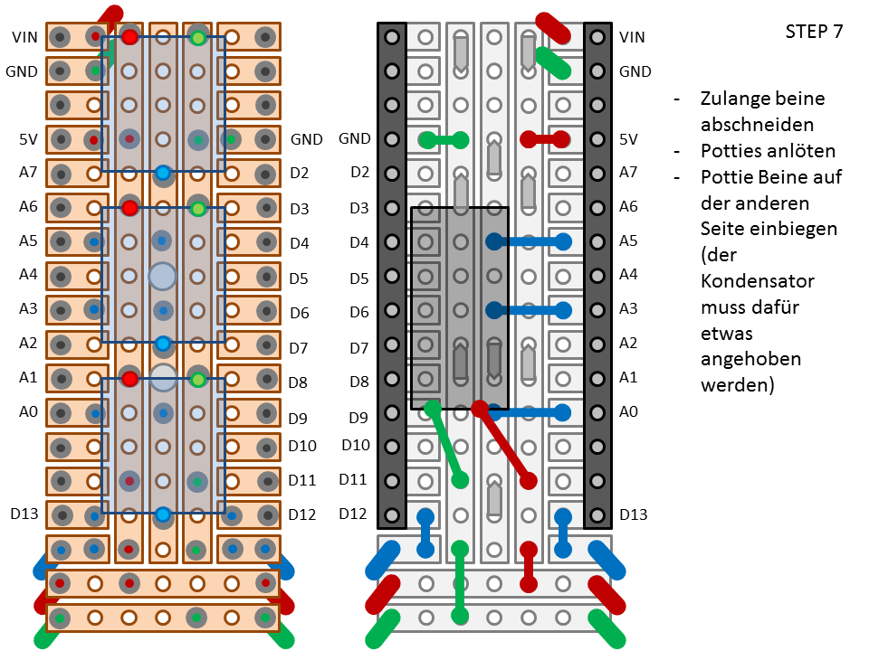

# embot version 0
This is a first functional prototype of embot which was used in the Embodied Artificial Intelligence lecture in winter 2019.

## component list
* 1 x Arduino Nano or compatible (the design also works with Arduino Mini)
* 1 x Prototype board (enough for 3 robots)
https://www.conrad.de/de/tru-components-su527831-ic-platine-epoxyd-l-x-b-160-mm-x-100-mm-35-m-rastermass-254-mm-inhalt-1-st-1570124.html
* 3 x Potentiometer: ACP 9-LRS 10K
https://www.reichelt.com/de/de/einstellpotentiometer-liegend-10-kohm-9-mm-acp-9-lrs-10k-p111808.html?&trstct=vrt_pdn
* 3 x Steckachse: ACHSE ACP 9 S
https://www.reichelt.com/de/de/steckachse-6-x-19-7-mm-schwarz-achse-acp-9-s-p111813.html?&trstct=pol_1
* 1 x Kondensator: Teapo SY 1000 uF / 16 V 10 x 16 mm Elektrolyt-Kondensator
https://www.conrad.de/de/teapo-sy-1000-uf-16-v-10-x-16-mm-elektrolyt-kondensator-radial-bedrahtet-5-mm-1000-f-16-v-20-o-x-l-10-mm-x-16-mm-443933.html
* 2 x Steckerleisten für Arduino
* Flexible Kabel für Servos:
https://www.conrad.de/de/servo-litze-1x-offenes-ende-1x-offenes-ende-5-m-3-x-017-mm-verdrillt-reely-808909.html
* [optional] 2 x fertiges Servo Kabel:	
https://www.conrad.de/de/servo-gegenkabel-1x-jr-stecker-1x-offenes-ende-300-mm-014-mm-flach-modelcraft-223729.html
* Flexible Kabel für den Akku:
https://www.conrad.de/de/akku-gegenkabel-2x-bec-stecker-2x-offenes-ende-014-mm-modelcraft-208287.html
* Stecker für die Servos:
https://www.conrad.de/de/modelcraft-servo-stecker-lose-jr-1-paar-223998.html
* Akku: Conrad energy Modellbau-Akkupack (LiPo) 7.4 V 1000 mAh
https://www.conrad.de/de/conrad-energy-modellbau-akkupack-lipo-74-v-1000-mah-zellen-zahl-2-25-c-softcase-bec-buchse-1344143.html

## step by step instruction:

